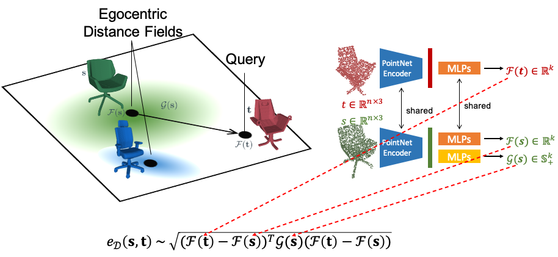

# Deformation-Aware Embedding 3D Model Embedding and Retrieval
**[Deformation-Aware Embedding 3D Model Embedding and Retrieval](https://deformscan2cad.github.io)** 

Mikaela Angelina Uy, Jingwei Huang, Minhyuk Sung, Tolga Birdal and Leonidas Guibas

ECCV 2020



## Introduction
We introduce a new problem of retrieving 3D models that are deformable to a given query shape and present a novel deep deformation-aware embedding to solve this retrieval task. 3D model retrieval is a fundamental operation for recovering a clean and complete 3D model from a noisy and partial 3D scan. However, given a finite collection of 3D shapes, even the closest model to a query may not be satisfactory. This motivates us to apply 3D model deformation techniques to adapt the retrieved model so as to better fit the query. Yet, certain restrictions are enforced in most 3D deformation techniques to preserve important features of the original model that prevent a perfect fitting of the deformed model to the query. This gap between the deformed model and the query induces asymmetric relationships among the models, which cannot be handled by typical metric learning techniques. Thus, to retrieve the best models for fitting, we propose a novel deep embedding approach that learns the asymmetric relationships by leveraging location-dependent egocentric distance fields. We also propose two strategies for training the embedding network. We demonstrate that both of these approaches outperform other baselines in our experiments with both synthetic and real data. Our project page can be found [here](https://deformscan2cad.github.io), and the arXiv version of our paper can be found [here](https://arxiv.org/abs/2004.01228).
```
@inproceedings{uy-deformawareretrieval-eccv20,
      title = {Deformation-Aware 3D Model Embedding and Retrival},
      author = {Mikaela Angelina Uy and Jingwei Huang and Minhyuk Sung and Tolga Birdal and Leonidas Guibas},
      booktitle = {European Conference on Computer Vision (ECCV)},
      year = {2020}
  }
```

## Data download
1) Dataset downloads can here found here. Please download all the zipped files below.
 * [ShapeNet Watertight Manifolds](http://download.cs.stanford.edu/orion/deformation_aware_embedding/ShapeNetManifold_simplified.zip) : for `SHAPENET_BASEDIR`.
 * [Positive Candidates](http://download.cs.stanford.edu/orion/deformation_aware_embedding/manifold_top50_cd_candidates.zip) : for `POSITIVE_CANDIDATES_FOL`.
 * [Negative Candidates](http://download.cs.stanford.edu/orion/deformation_aware_embedding/manifold_negatives_cd_candidates.zip) : for `NEGATIVE_CANDIDATES_FOL`.
 * [Ranking Evaluation](http://download.cs.stanford.edu/orion/deformation_aware_embedding/manifold_testrank_candidates.zip) : for the ranking evaluations in the paper.

2) Download and extract h5 files for each object class (chair, table, sofa, car, airplane) [here](https://drive.google.com/file/d/1dcThUNexgN5_nmW1Es9GCwuBQi0ITRit/view?usp=sharing), and place all h5 files in `candidate_generation/` 

3) Download and extract pickle files [here](https://drive.google.com/file/d/15jKM7AHZPuA-GyySSSEWk-lqxQuyCkjY/view?usp=sharing) that contain sampled positives and negatives for each model with pre-computed fitting gaps. Extract this folder in `retrieval/`.

Goto `retrieval/` for training/test of our networks and the baselines. The code was built and tested with python 2.7 and tensorflow 1.12.0.

## Our Deformation-Aware Embedding
### Ours-Reg:
1) Construct data for network training/test for Ours-Reg:
```
cd generate_deformed_candidates/
python arap_distances.py --category=chair --data_split=train
python get_object_sigmas.py --category=chair --data_split=train
```
2) Network training:
```
python train_ours_distances.py --category=chair
```
3) Retrieval:
Select the desired model and result directory with flags `--model_path` and `--dump_dir`
```
python retrieval_gaussian.py --category=chair
```

### Ours-Margin:
1) Construct data for network training/test for Ours-Margin:
```
cd generate_deformed_candidates/
python arap_triplets.py --category=chair --data_split=train
```
2) Network training:
```
python train_ours_triplet.py --category=chair
```
3) Retrieval:
Select the desired model and result directory with flags `--model_path` and `--dump_dir`
```
python retrieval_gaussian.py --category=chair
```

## Baselines:
### Ranked-CD:
1) Retrieval:
```
python cd_neighbors.py --category=chair
```

### AE:
1) Network training:
```
python train_autoencoder.py --category=chair
```
3) Retrieval:
Select the desired model and result directory with flags `--model_path` and `--dump_dir`
```
python retrieval.py --category=chair --model=pointnet_autoencoder
```

### CD-Triplet:
1) Construct triplets based on chamfer distances. First, update `SHAPENET_BASEDIR` in `generate_deformed_candidates/chamfer_triplets.py`, then run:
```
cd generate_deformed_candidates/
python chamfer_triplets.py --category=chair --data_split=train
```
2) Network training:
```
python train_triplet.py --category=chair
```
3) Retrieval:
Select the desired model and result directory with flags `--model_path` and `--dump_dir`
```
python retrieval.py --category=chair --model=pointnet_triplet
```

## Evaluation of fitting gap (post-deformation chamfer distance)
### Pre-requisites
#### Compile deformation function
In our experiments we chose to use a simplest version of deformation function found [here](https://github.com/hjwdzh/MeshODE). Please follow the installation pre-requisites found in this [repo](https://github.com/hjwdzh/MeshODE) to build.
```
cd ../meshdeform
mkdir build 
cd build/
cmake .. -DCMAKE_BUILD_TYPE=Release
make -j8
```
#### Compile point-to-mesh distance function
In our paper, we report the point-to-mesh distance for fitting loss (an alternative approximate is to use a point cloud to point cloud distance). To use the point-to-mesh distance metric, first compile the function by running:
```
cd ../tools/evaluation
mkdir build
cd build/
cmake .. -DCMAKE_BUILD_TYPE=Release
make -j8
```

### Scripts
Update `SHAPENET_BASEDIR` in `evaluate_fitting_deform_fast.py`, `evaluate.py`, `evaluate_point2mesh` and `evaluate_testrank.py`, and select the desired  result directory with flag`--dump_dir` for all the evaluation scripts below.

Run for fitting error post-deformation:
```
python evaluate_fitting_deform_fast.py --category=chair
```

For the ranking evaluation found in our paper, select the desired model and result directory with flags `--model_path` and `--dump_dir`, and then run:
```
python retrieval_gaussian.py --category=chair --testrank=1
python evaluate_testrank.py --category=chair
```

For fitting error without deformation, run:
```
python evaluate_point2mesh.py --category=chair --fitting_dump_dir=point2mesh_new2_nodeform/
```

## Pre-trained Models
Pre-trained models for Ours-Margin and Ours-Reg for the five object classes can be found [here](https://drive.google.com/file/d/1y3A8i1t_eEOizS-Mzvl4fgH_pj4utcfK/view?usp=sharing).

## Create your own training samples
To create your own data by sampling positive and negative samples and pre-computing fitting-gaps, first change `SHAPENET_BASEDIR` in candidate_generation/get_candidates.py and `POSITIVE_CANDIDATES_FOL` and `NEGATIVE_CANDIDATES_FOL` in retrieval/chamfer_distance_deformed_candidates.py. Then run:

1) Sampling of positives and negatives
```
cd candidate_generation/
python get_candidates.py --category=chair --data_split=train
python get_candidates.py --category=chair --data_split=test
python get_candidates.py --category=chair --data_split=train --generate_negatives=1
python get_candidates.py --category=chair --data_split=test --generate_negatives=1
```

2) Pre-computing fitting gaps
```
cd retrieval/generate_deformed_candidates/
python chamfer_distance_deformed_candidates.py --category=chair --data_split=train
```

## License
This repository is released under MIT License (see LICENSE file for details).
